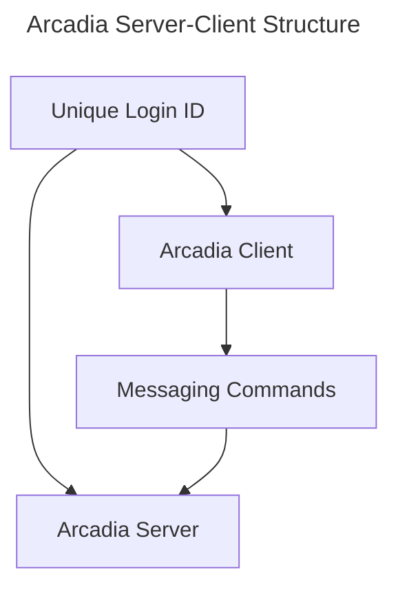

# Arcadia

Simple-minded barebone websocket-based message server where anyone is welcome. All users are welcomed as a unique guest untill lock-in a login. Arcadia doesn't store chat history and uses a very simple token-based authentication to provide basic identity. The purpose of this server is: 1) Provide a live chatting environment for Parcel, 2) Foster primitive communities, 3) Make it super easy to maintain and super easy to develop a client for.

Simple message format: `-channel message`. Where message may be used as a command.  
Channel should not contain space and must start with `-`; If no channel is specified, it uses default channel.

(At the moment Arcadia doesn't have a central server yet)

TODO:

- [ ] Support listening to multiple channels.

## Features/Limitations

As a program-accessible global authentication free broadcast server, Arcadia is designed to foster a healthy real-time help and discussion community experience with those feature decisions in mind: 

* Guests are limited 250 word message per minute.
* Any user is limited to sending messages to current channel only. (Actually this doesn't stop programs from troll)
* Users are automatically ranked by Live Time, Age (Duration time) and @Frequency as a single Rank Score/EXP = Live Time in Seconds + Inception in Months + Unique @ Users (not occurrences) * 25. 
* Server admin have power over user administration through admin-specific commands.

## Commands

Commands can be used in message. Commands are case-insensitive.

* (Default) `!speak <content>`: Speak at specific channel.
* `!loging <username> <token> <email>`: Login to server; if username is not taken, it will be registered. Token is used to authenticate user and only the hash will be saved so it cannot be recovered - provide an email address if you wish to recover your account. Login provides benefits like unique username and server-side configuration storage (for listening channels). Login doesn't alter session ID (or guest ID); The same login may be used by multiple sessions/guest IDs.
* `!listen`: Listen to only specified channels - this should be saved as per user/login configuration.

## Arcadia Clients

All messages are generally handled on the server side - client is just responsible for providing an interface and sending messages to the server. On the other hand, all clients should support two actions: 1) Specify (default) channel, 2) Specify server to connect to. The second action is important because Arcadia likely have lots of atomic servers (seeds).

## Developer Guide: Develop Custom Arcadia Client

To develop a custom Arcadia client, just connect to the server endpoint, then start messaging like you would on a chat!
